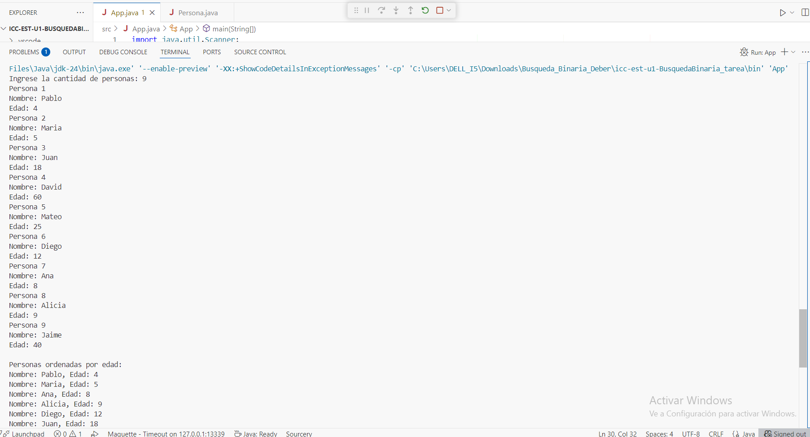
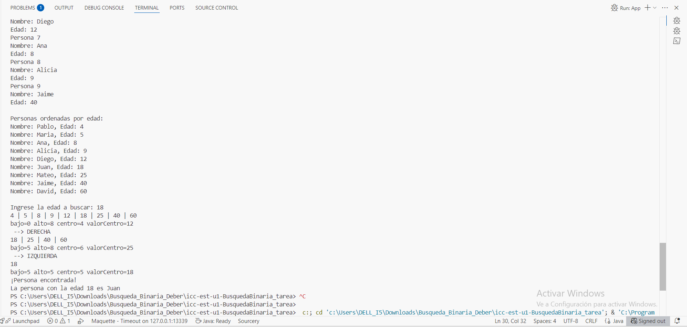

# Mi Trabajo de Estructura de Datos

Este proyecto muestra la ejecución de un programa que permite dado un arreglo, buscar una persona por su edad mediante la búsqueda binaria.
Encontrando la pimera persona con dicha edad.

## 📸 Capturas de pantalla

### 1. Ejecución del programa

### 2. Resultado final

## 👤 Autor

Thalia Maribel Sagbay Peña  
[GitHub](https://github.com/thalisg12/icc-est-u1-MetodoBusquedaBinaria.git)

